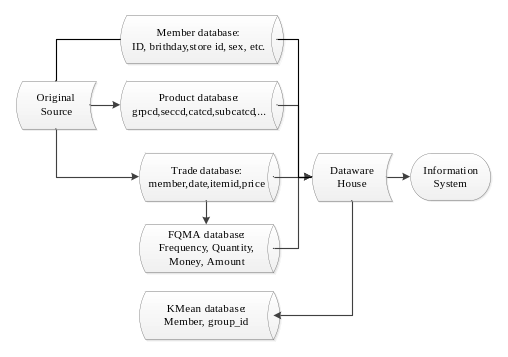
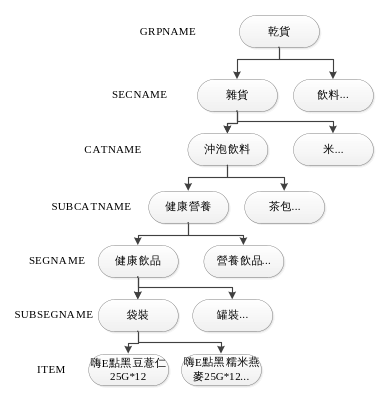

# 00 原始資料介紹

本專案使用某連鎖零售業者 2014–2016 年的實際營運資料。原始資料因屬真實營運資料未公開，本文說明其結構與規模。

> **本文所有欄位範例值皆為符合格式的虛構值，非真實資料。**

資料的品質問題、清洗判斷與處理方式，見 [01 交易明細清洗](01_transaction_cleaning.md)、[02 會員資料清洗](02_member_cleaning.md)。

---

## 資料來源與使用範圍

業者提供的資料庫涵蓋全台約 20 家分店，共三個資料庫：

- **交易紀錄資料庫**：2014-01 ~ 2016-10，三年合計約 3 億筆
- **會員資料庫**：約 600 萬名會員
- **商品資料庫**：約 63 萬種品項

**本專案僅使用其中單一分店（代號 716）的資料**，因此實際處理量為 27,671,526 筆，約占全資料庫的 9%。該店一年約有 16 萬名活躍會員來店，平均每位會員一年來訪 5–6 次；全資料庫 63 萬種商品中，該店一年實際有銷售的約 5 萬 2 千種。

三個資料庫的連結方式：交易紀錄與商品資料以 `ITEMID` 對應；交易紀錄的 `CUSTCD` 與會員資料的 `NBU_CARD` 對應（非 `MEMBER_ID`，後者為內部編號）。

*圖 1　零售資料流程圖*

---

## 檔案清單

| 檔案 | 內容 | 規模 |
|------|------|------|
| `2014716new.csv` `2015716new.csv` `2016716new.csv` | 716 店交易明細，一列一個商品品項 | 合計 27,671,526 筆 |
| `member.csv` | 會員主檔（全業者，未依分店篩選） | 約 600 萬筆 |
| `weather_data.csv` | 每日氣象（外部資料） | 2014–2016 每日一筆 |

編碼為 `utf_8_sig`。檔名中的 `716` 為分店代號。

---

## 資料期間與筆數

| 年度 | 筆數 | 備註 |
|------|------|------|
| 2014 | 9,704,506 | |
| 2015 | 9,135,383 | **2015-11 整月缺失** |
| 2016 | 8,461,504 | 僅到 10 月 |

> 上表為扣除日期異常紀錄（370,133 筆，詳見 [01 交易明細清洗](01_transaction_cleaning.md)）之後的數字，三年合計 27,301,393 筆。

---

## 交易資料欄位

一列代表一筆交易中的一個商品品項，因此同一次結帳會產生多列。以下為主要欄位，非完整清單。

| 欄位名稱 | 說明 | 範例（虛構） | 本專案 |
|---|---|---|:---:|
| `CHAINID` | 系統碼 | `101` | — |
| `LOCID` | 分店 | `716` | — |
| `TRANSTIMESTAMP` | 交易日期 | `19JAN2014:00:00:00.000` | ✅ |
| `POSREGISID` | 機台編號 | `16` | — |
| `CASHID` | 收銀員 | `201` | — |
| `SCANCD` | 商品條碼 | `4710000000017` | — |
| `ITEMID` | 品項號碼 | `100001` | ✅ |
| `UNITSALESPRICE` | 定價 | `59` | — |
| `TAMT` | 客戶付款金額 | `59` | — |
| `ITEMQTY` | 商品購買數量 | `1` | — |
| `TAXAMT` | 稅 | `3` | — |
| `CUSTCD` | 客戶卡號 | `95520011223344500000` | ✅ |

---

## 會員資料欄位

每位會員一筆資料。以下為主要欄位，非完整清單。

| 欄位名稱 | 說明 | 範例（虛構） | 本專案 |
|---|---|---|:---:|
| `MEMBER_ID` | 卡友編號（內部編號） | `2000200012345` | — |
| `MUID` | 卡友虛擬 ID | `F900123456` | — |
| `BIRTHDAY_Y` | 生日年 | `1985` | ✅ |
| `BIRTHDAY_M` | 生日月 | `6` | ✅ |
| `SEX` | 性別 | `1` | ✅ |
| `EDUCATION` | 教育程度 | `4` | — |
| `STORE_ID` | 辦卡分店別 | `716` | ✅ |
| `BTIME` | 第一次辦卡日期 | `2010-03-15` | ✅ |
| `CTIME` | 最後一次修改日期 | — | — |
| `NBU_CARD` | 客戶卡號（對應交易明細 `CUSTCD`） | `95520002000012300000` | ✅ |
| `E_DM` | 是否願意收 Email（1 為是） | `1` | — |
| `PROMOTION_MESG` | 是否可寄簡訊（1 為是） | `0` | — |
| `SEND_DM` | 是否願意收 DM（1 為是） | `0` | — |
| `ZIP_CODE5` | 郵遞區號五碼 | `33001` | ✅ |

**會員涵蓋率**：交易明細中 286,810 個不重複 `CUSTCD`，78.7%（225,842 個）能對應到會員主檔，21.3%（60,968 個）對不上。

---

## 商品資料欄位

商品採六層分類，第七層為實際販售的品項。同一類產品因包裝規格不同會拆成不同品項，但歸屬相同分類。全資料庫共約 63 萬種品項，每項皆有獨立 `ITEMID`。

| 欄位名稱 | 說明 | 範例（虛構） |
|---|---|---|
| `GRPCD` / `GRPNAME` | 第一層分類編號／名稱 | `06` / `06 APPLIANCES 電器` |
| `SECCD` / `SECNAME` | 第二層分類編號／名稱 | `060` / `060 SERVICE WHITE 配送家電` |
| `CATCD` / `CATNAME` | 第三層分類編號／名稱 | `600` / `600 REFRIGERATOR 冰箱` |
| `SUBCATCD` / `SUBCATNAME` | 第四層分類編號／名稱 | `003` / `003 3 DOORS 三門` |
| `SEGCD` / `SEGNAME` | 第五層分類編號／名稱 | `010` / `010 UNDER 500L 500L以下` |
| `SUBSEGCD` / `SUBSEGNAME` | 第六層分類編號／名稱 | `001` / `001 UNDER 500L 500L以下` |
| `ITEMID` | 品項號碼 | `100001` |
| `CHINESENAME` | 品項名稱 | `A牌 460L 三門冰箱` |

*圖 2　產品分類階層圖*

